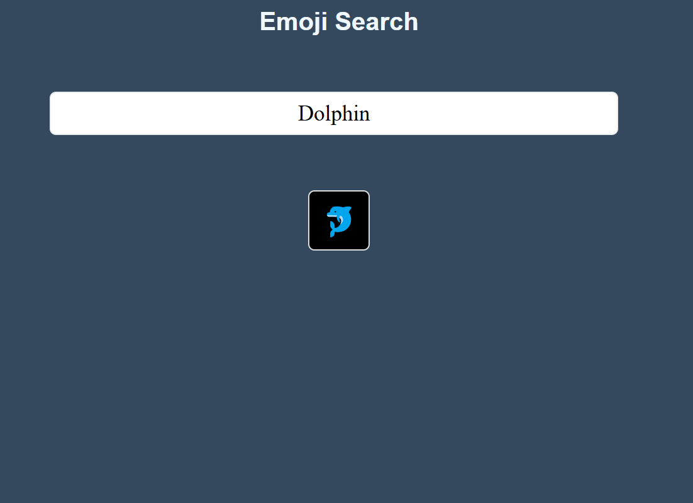

# 🦸‍♀️ Emoji Tracker App

A simple **React** application that allows users to type emoji names and have them replaced with the corresponding emoji once the word is complete.

## 📌 Features
- ✅ **Type Emoji Names**: Users can type the name of an emoji (e.g., "happy", "pizza") in the input box.
- ✅ **Automatic Emoji Replacement**: Once the word is typed completely, it is replaced by the corresponding emoji.
- ✅ **Responsive Design**: Works across different screen sizes and devices.
- ✅ **Minimalist UI**: Clean and simple design for ease of use.

## 🛠️ Technologies Used
- ⚛️ **React** (useState and useEffect for state management and handling input events)
- 🎨 **CSS** (for styling the user interface)
- 📄 **HTML** (for structuring content)

## 🚀 Live Demo
To see it in action, clone the repository and follow the setup instructions below.

1. **Clone the repository:**

   ```bash
   git clone https://github.com/Eshhaa11/emoji-search-filter
   
2. **Navigate to the project directory:**

   cd grocery-list

3. **Install dependencies:**

   npm install

4. **Start the development server:**

   npm start

5. **Open your browser and visit:**

   http://localhost:3000

 ## 🎨 Screenshots:
 